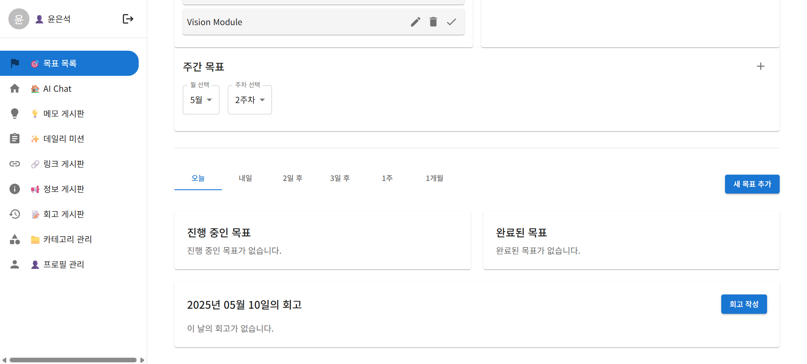
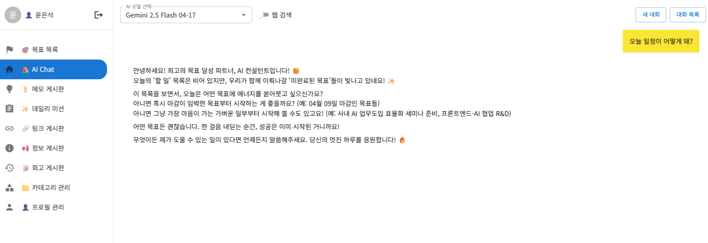
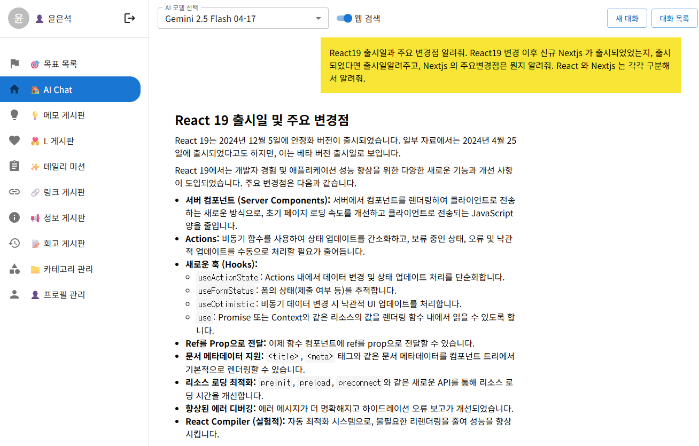

# FrontTeamTask - 프론트엔드 개발자 일정 관리 시스템

- 일정관리 <br><br>
   <br>

- LLM1 <br><br>
   <br>

- LLM2 (Grounding with Google Search) <br><br>
   <br>

## 프로젝트 개요

FrontTeamTask는 고피자의 프론트엔드 개발자들의 편의를 위해 사이드 프로젝트로 nextjs로 풀스택 개발한 일정관리 및 다양한기록기능 및, AI 어시턴트가 포함된 시스템입니다.

## 기술 스택

### 프론트엔드

- **프레임워크**: Next.js 15.0.3, React 19
- **UI 라이브러리**: Material UI 6.1.7, Emotion
- **폼 관리**: React Hook Form, Zod 유효성 검증

### 백엔드

- **서버**: Next.js API Routes
- **데이터베이스**: PostgreSQL
- **인증**: JSON Web Tokens (JWT), bcrypt
- **SQL 쿼리**: 직접 작성된 raw SQL 쿼리 사용

### AI 통합

- **프레임워크**: LangChain
- **모델 통합**:
  - OpenAI API (@langchain/openai)
  - Anthropic API (@langchain/anthropic)
  - Google Generative AI (@google/generative-ai)
- **메모리 최적화**: 컨텍스트 메모리, 요약 메모리 구현

### 배포

- **호스팅**: Vercel
- **데이터베이스 호스팅**: AWS RDS (PostgreSQL)

## 아키텍처 설계 및 특징

### 풀스택 개발 접근법

FrontTeamTask는 고전적인 백엔드/프론트엔드 분리 대신 통합된 풀스택 접근법을 채택했습니다. Next.js의 API Routes를 활용하여 별도의 백엔드 서버 없이 전체 애플리케이션을 구축했습니다. 이는 개발 속도를 높이고 배포 복잡성을 줄이는 데 도움이 되었습니다.

```
                       ┌─────────────────┐
                       │  Next.js App    │
                       │                 │
                       └───────┬─────────┘
                               │
                ┌──────────────┴───────────────┐
                │                              │
    ┌───────────▼────────────┐    ┌────────────▼──────────┐
    │   Client-side React    │    │  Server-side API      │
    │   (Pages & Components) │    │  (API Routes)         │
    └───────────┬────────────┘    └────────────┬──────────┘
                │                               │
                │                  ┌────────────▼──────────┐
                │                  │  Direct SQL Queries   │
                │                  └────────────┬──────────┘
                │                               │
                │                  ┌────────────▼──────────┐
                └──────────────────►    PostgreSQL DB      │
                                   └─────────────────────┘
```

### 직접 SQL 쿼리 접근법

ORM 대신 직접 SQL 쿼리를 사용하는 전략적 결정을 내렸습니다. 이 접근법은 다음과 같은 이점을 제공합니다:

1. **성능 최적화**: 복잡한 조인과 서브쿼리를 포함한 고성능 쿼리 직접 작성
2. **데이터베이스 특화 기능**: PostgreSQL의 고급 기능을 완전히 활용
3. **학습 기회**: 팀원들의 SQL 역량 강화

예시 코드:

```typescript
// API 엔드포인트에서 직접 SQL 쿼리 사용 예시
const todaysGoalsResult = await pool.query<Goal>(
  `SELECT * FROM goals 
   WHERE user_id = $1 
   AND start_date >= $2 
   AND end_date <= $3 
   AND status != '완료'
   ORDER BY start_date ASC`,
  [authUser.id, todayStart, todayEnd]
);
```

### LLM 통합 및 메모리 최적화

사이드 프로젝트인 만큼 실용성 뿐 아니라, 하나의 playgorund 프로젝트로써, 다양한 LLM 모델을 선택해 사용함으로써 LLM모델들에 대한 특성을 지속적으로 관찰, 파악할 수 있게 하였습니다.:

1. **다중 모델 지원**: OpenAI(GPT-4o, GPT-4o-mini), Anthropic(Claude), Google Gemini 등 모델 선택 가능

2. **메모리 최적화 전략**:
   - **컨텍스트 메모리**: 사용자의 목표와 일정을 AI 대화 컨텍스트에 통합
   - **요약 메모리**: 긴 대화를 요약하여 컨텍스트 창 제한 극복
   - **선택적 메모리 로딩**: 필요한 정보만 컨텍스트에 로드하여 토큰 사용 최적화

```typescript
// 시스템 메시지 생성 예시 (컨텍스트 메모리 사용)
const systemMessageContent = generateSystemMessage(
  todaysGoalsResult.rows, // 오늘의 목표
  incompleteGoalsResult.rows, // 미완료 목표
  categoriesResult.rows // 사용자 카테고리
);
```

## 주요 기능

### 📋 목표 및 작업 관리

- **다중 시간 범위 목표 설정**: 일간, 주간, 월간, 장기 목표 설정 및 추적
- **카테고리화**: 업무 영역별 분류 및 관리
- **상태 추적**: 작업 진행 상태 실시간 모니터링

### 📂 게시판 기능

- **링크 게시판**: 유용한 개발 자료, 문서, 튜토리얼 등의 링크 공유 및 관리
- **카테고리별 정리**: 주제별로 링크 및 게시물 분류 시스템

### 🤖 AI 어시스턴트

- **다중 AI 모델 지원**: OpenAI(GPT-4o, GPT-4o-mini), Anthropic(Claude), Google Gemini 등 모델 선택 가능
- **맥락 인식 대화**: 사용자의 목표와 작업을 반영한 지능적 응답
- **대화 세션 관리**: 이전 대화 저장 및 불러오기
- **코드 개선 제안**: 개발 작업에 대한 AI 기반 코드 최적화 제안

### 👥 사용자 관리

- **인증 및 권한**: 안전한 JWT 기반 인증 시스템
- **프로필 관리**: 개인화된 설정 및 선호도
- **활동 로그**: 사용자 활동 기록 및 분석

## 환경 변수 설정

프로젝트 실행을 위해 `.env.local` 파일에 다음 환경 변수를 설정하세요:

```
# 데이터베이스 설정
DB_HOST=your-postgresql-host
DB_PORT=5432
DB_USERNAME=your-username
DB_PASSWORD=your-password
DB_NAME=your-db-name

# 인증 설정
JWT_SECRET=your-secure-jwt-secret
NEXTAUTH_SECRET=your-secure-nextauth-secret
NEXTAUTH_URL=http://localhost:3000

# AI API 키
NEXT_PUBLIC_OPENAI_API_KEY=your-openai-api-key
ANTHROPIC_API_KEY=your-anthropic-api-key
NEXT_PUBLIC_GOOGLE_API_KEY=your-google-api-key
```

## 설치 및 실행

```bash
# 저장소 클론
git clone https://github.com/gopizza/FrontTeamTask.git
cd FrontTeamTask

# 의존성 설치
yarn install

# 개발 서버 실행
yarn dev

# 프로덕션 빌드
yarn build
yarn start
```
